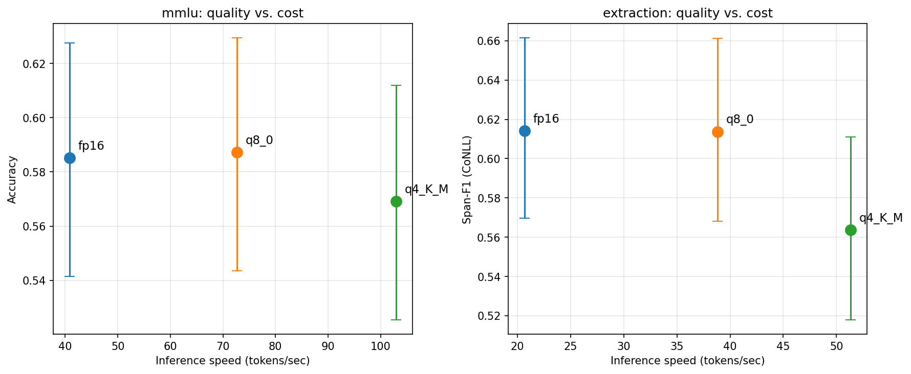

# Quantization Effects on LLM Output Quality

**A controlled paired study of Llama 3.1 8B Instruct: FP16 vs Q8_0 vs Q4_K_M**

Kristen Martino · [kristenmartino.ai](https://kristenmartino.ai) · [Repo](https://github.com/kristenmartino/llm-quantization-study)

[](https://github.com/kristenmartino/llm-quantization-study/actions/workflows/test.yml)

---

## TL;DR

Scope: Llama 3.1 8B Instruct, two English tasks, deterministic decoding (temp=0), local Ollama on Apple Silicon/Metal. See [Limitations](#limitations).

**Ship Q8_0 as the default.** It is *practically equivalent* to FP16 — not merely "not significantly different," but equivalent under a specified ±1pp practical-equivalence margin (TOST): MMLU accuracy Δ=−0.2pp (p_TOST=0.019) and NER macro-F1 Δ=+0.0003 (p_TOST=0.002) both clear the equivalence bar, and the NER micro-F1 95% CI [−0.9, +0.2]pp sits entirely inside ±1pp. You get this at ~1.8× the throughput and roughly half the memory footprint.

**Reach for Q4_K_M only when memory or latency is binding *and* the workload doesn't include structured information extraction.** Q4_K_M shows a measurable NER degradation — **−3.2pp on corpus micro-F1, the canonical CoNLL metric** (95% CI: 0.7–5.7pp; Holm-adjusted p=0.032) — with a larger **−5.0pp drop in mean per-sentence (macro) F1** (CI: 2.1–8.1pp; p=0.003). The gap between the two metrics localizes the failure: Q4 stays competitive on aggregate entity counts but more often fails *entity-free* sentences, hallucinating a spurious entity ~62% of the time vs ~40% for FP16/Q8. The hit is a precision problem (−4.1pp precision, −0.9pp recall), not a recall one — it over-extracts. The MMLU regression (1.6pp) does not reach significance. You buy this for ~40% more throughput (2.5× FP16) and an ~3× smaller footprint.

## Why this matters for PMs

Model quantization is a routine production decision: ship at FP16 and pay for the GPU memory, or ship at Q4 and absorb some quality loss for cheaper, faster inference. Most teams pick by feel. This study quantifies the cost/quality tradeoff on a single model family using the same prompts and sampling, so the only thing varying is precision. The output is a decision framework, not a benchmark leaderboard.

---

## Method

**Treatment.** Quantization level — three arms: FP16 (control), Q8_0, Q4_K_M. All three pulled from Ollama: `llama3.1:8b-instruct-{fp16|q8_0|q4_K_M}`.

**Tasks.**
- **MMLU (knowledge/reasoning).** Stratified subset of 500 questions across 10 subjects (STEM, professional, humanities). Mechanically scored: parse first A–D character from output, compare to gold.
- **Named entity recognition (CoNLL-2003).** 300 sentences from the test split → JSON array of (entity, type) pairs, scored by exact span match with type agreement. Two F1 estimands are reported: **corpus micro-F1** (the canonical CoNLL/conlleval metric — pool TP/FP/FN across the corpus, then F1) as the primary headline, and **per-sentence macro-F1** (mean of per-example F1) as a secondary, production-relevant view. They diverge when errors concentrate in particular sentence types, which is itself a finding here. Liberal alias parser for `text|entity|span` and `type|label|tag` keys; malformed JSON contributes its gold spans as false negatives (micro) / scores 0 (macro).

**Design.** Examples paired across arms: same items, same prompts, same seed (42). Arms run round-robin per example to debias inference timing against thermal/daemon drift; warmups for all arms precede the timed loop.

**Sampling.** Temperature = 0, fixed seed (42), identical prompts and system messages, max_tokens task-appropriate. Held constant across arms.

**Statistics.**
- MMLU: Wilson 95% CI per arm on accuracy. Paired pairwise differences via paired bootstrap, with cluster-bootstrap on subjects for the overall CI (within-subject correlation is real). p-values from McNemar's test.
- NER: corpus micro-F1 per arm with bootstrap CI (resample examples, re-pool counts); paired pairwise micro-F1 differences via paired bootstrap (CIs + two-sided p-values centered under H0). Per-sentence macro-F1 reported alongside with the same paired machinery on per-example deltas.
- Multiple-comparison correction: Holm-Bonferroni applied per task across the 3 pairwise tests (separately for the micro and macro families).
- **Equivalence.** "Q8_0 ≈ FP16" is a TOST result against a **specified ±1pp practical-equivalence margin** — a round, interpretable threshold chosen for this equivalence reanalysis as the largest difference that would still count as "the same," not tuned to the observed intervals. Two one-sided tests, equivalently the 90% CI lying inside ±0.01. A non-significant difference is *not* treated as evidence of equivalence.

**Power.** At n=499 aligned per arm on MMLU, detects ≥3.8pp accuracy differences at 80% power, α=0.05 (paired diff SD = 0.30 observed). At n=300 per arm on NER, detects per-sentence F1 differences ≥4.3pp (paired diff SD = 0.27 observed). Both post-hoc verified on the actual data.

**One MMLU example dropped (n=499 aligned).** `cais/mmlu`'s `high_school_mathematics` test split contains a genuine duplicate question — the same word problem with shuffled answer choices but the same correct answer. The harness keys analysis on a row-unique `example_id` (`{subject}::{row_index}::{qhash}`) and fingerprints content with a separate `content_hash`, so distinct rows can never silently collapse; `analyze.py` now warns loudly when it collapses the duplicate rather than dropping it silently. The dropped occurrence scored identically in all three arms, so the ~0.1pp accuracy shift changes no conclusion. (The original run hashed question text only; this is the corrected scheme — both leave the published n=499 numbers intact.)

**Provenance.** `results/experiment_manifest.json` records the per-arm model digests (weight-blob SHA256), the modelfile/template, Ollama version, host, seed, sampling options, and dataset ids — so the "only quantization varied across arms" assumption is backed by recorded artifact identity, not assumed. The three weight-blob hashes differ (as expected for distinct quantizations) while stop tokens and chat template are identical across arms.

**Hardware.** MacBook Pro (Apple M4 Max, 14-core CPU / 32-core GPU, 36 GB unified memory), Ollama 0.22.1, llama.cpp Metal backend.

---

## Results

### Headline numbers

| Arm     | MMLU accuracy [95% CI] | NER micro-F1 (canonical) [95% CI] | NER macro-F1 (per-sentence) | NER precision / recall | tok/sec (MMLU / NER) | Memory¹  |
|---------|-------------------------|------------------------------------|------------------------------|------------------------|----------------------|----------|
| FP16    | 0.585 [0.541, 0.628]    | 0.649 [0.600, 0.696]               | 0.614 [0.570, 0.662]         | 0.553 / 0.785          | 40.9 / 20.7          | ~16.0 GB |
| Q8_0    | 0.587 [0.544, 0.630]    | 0.652 [0.604, 0.698]               | 0.614 [0.568, 0.661]         | 0.557 / 0.785          | 72.7 / 38.8          | ~8.5 GB  |
| Q4_K_M  | 0.569 [0.525, 0.612]    | 0.617 [0.567, 0.665]               | 0.564 [0.518, 0.611]         | 0.512 / 0.776          | 102.9 / 51.3         | ~4.9 GB  |

micro-F1 is the canonical CoNLL metric (the headline); macro-F1 is the mean per-sentence score (the brittleness view). Precision/recall is pooled corpus-level.

¹ Model footprint as reported by Ollama (`ollama show`). On Apple Silicon this is unified memory, not discrete VRAM; runtime usage adds KV cache and activation overhead. On a 36 GB M4 Max, FP16 is the largest model that comfortably runs alongside other workloads — the memory column matters as much as the throughput column.

### Pairwise effect sizes (paired CIs; Holm-adjusted within task)

| Comparison        | MMLU Δ accuracy [95% CI; p_adj]    | NER Δ micro-F1 [95% CI; p_adj]            | NER Δ macro-F1 [95% CI; p_adj]            |
|-------------------|--------------------------------------|---------------------------------------------|---------------------------------------------|
| FP16 − Q8_0       | −0.002 [−0.008, +0.004]; p_adj=1.00  | −0.003 [−0.009, +0.002]; p_adj=0.29         | +0.000 [−0.006, +0.007]; p_adj=0.92         |
| FP16 − Q4_K_M     | +0.016 [−0.006, +0.036]; p_adj=0.70  | **+0.032 [+0.007, +0.057]; p_adj=0.032***   | **+0.050 [+0.021, +0.081]; p_adj=0.003***   |
| Q8_0 − Q4_K_M     | +0.018 [−0.002, +0.038]; p_adj=0.70  | **+0.035 [+0.009, +0.060]; p_adj=0.030***   | **+0.050 [+0.020, +0.081]; p_adj=0.003***   |

Significance markers (`*`) use the Holm-adjusted p-value within each task/metric's 3-test family at α=0.05. **The Q4_K_M NER degradation is significant under both F1 estimands** — micro (the canonical metric, ~3.2pp) and macro (per-sentence, ~5.0pp) — so the finding is robust to metric choice; the macro figure is larger because per-sentence averaging amplifies the entity-free-sentence failures (see below). All MMLU pairs are NS after Holm. The FP16 − Q8_0 contrasts are ~0 on every metric — and, formally, *equivalent*:

### Equivalence: Q8_0 vs FP16 (TOST, ±1pp practical-equivalence margin)

| Metric                 | Δ (FP16 − Q8_0) | 90% CI (TOST)        | p_TOST | Verdict        |
|------------------------|------------------|----------------------|--------|----------------|
| MMLU accuracy          | −0.002           | [−0.008, +0.004]     | 0.019  | **equivalent** |
| NER macro-F1           | +0.000           | [−0.005, +0.006]     | 0.002  | **equivalent** |
| NER micro-F1 (95% CI)  | −0.003           | [−0.009, +0.002]     | —      | within ±1pp    |

This is the positive claim a non-significant test can't make: Q8_0 is *equivalent* to FP16 within ±1pp, not just "not detectably different."

### Quality vs. cost frontier



Q8_0 sits cleanly on the Pareto frontier — equivalent to FP16, ~1.8× the throughput. Q4_K_M earns an additional ~40% throughput (2.5× FP16) but pays for it on NER.

**The failure pattern is over-extraction, not malformed output.** Q4 has the *highest* JSON parse rate of the three arms (99.7%, vs. 99.0% FP16 and 98.7% Q8_0) — the brittleness is in *what* it extracts, not whether the JSON is well-formed. Decomposing the corpus counts, Q4's NER hit is almost entirely a precision problem: vs. FP16 it loses 4.1pp precision but only 0.9pp recall. It invents entities rather than missing them. Concretely, that over-extraction concentrates on **entity-free sentences**: of the 72 sentences (24% of the corpus) whose gold answer is the empty set, FP16 and Q8_0 correctly return `[]` ~60% of the time, but Q4 only 37.5% — it hallucinates a spurious entity on the rest. This is also exactly why macro-F1 (5.0pp) exceeds micro-F1 (3.2pp): per-sentence averaging gives each of those 72 empty sentences full weight, so a hallucination tanks a whole sentence to 0; corpus micro-F1 dilutes the same spurious entities across the full entity pool.

### Where the effect concentrates

The Q4 vs. FP16 gap on MMLU is concentrated in `miscellaneous` (−6.0pp) and `professional_medicine` (−6.0pp), with smaller regressions in `moral_scenarios`, `abstract_algebra`, and `machine_learning` (each −4.0pp). Several subjects move the other way — `professional_law` (+4.0pp), `college_computer_science` (+2.0pp), `high_school_us_history` (+2.0pp) — within the noise band for n=50/subject. None of the per-subject pairwise diffs survives Holm correction within the per-subject family of 3 tests, so this is suggestive heterogeneity worth flagging, not replicable evidence of subject-specific quantization sensitivity. The pattern is consistent with the published intuition that quantization hits broad-knowledge recall harder than narrow reasoning, but a properly powered subject-level study would need ~3× the per-subject sample size.

*Calibration against the literature — order-of-magnitude only.* Published 4-bit Llama evaluations using **other** quantization methods (GPTQ, AWQ, QLoRA) tend to report low-single-digit percentage-point degradation on standard benchmarks. Ollama's `Q4_K_M` is a different scheme — llama.cpp k-quants (block-wise mixed 4/6-bit with super-block scales) — so this is a sanity check on magnitude, not a like-for-like comparison; GPTQ/AWQ are post-training weight-only methods and QLoRA is an NF4 fine-tuning recipe, each with its own evaluation setup. With that caveat: the NER hit (3.2pp micro / 5.0pp macro) lands at or above that rough band, consistent with structured-output tasks stressing quantization harder than multiple-choice classification, and the MMLU move (1.6pp, NS) is within it.

---

## A decision framework

Based on these results, here's the call I'd make as a PM choosing a quantization level for a feature:

**Pick Q8_0 (the default):**
- Same measured quality as FP16 on both tasks, at ~1.8× throughput. The strongest evidence in the study is for Q8_0 ≈ FP16.
- Right call when you need a single model serving heterogeneous workloads.
- Right call when reasoning depth matters (multi-step, legal, medical) — MMLU shows Q8 holds.

**Pick Q4_K_M only when:**
- Throughput is the binding constraint and a measurable F1 hit on structured extraction is acceptable downstream (human review, retry logic, low-stakes outputs).
- Memory is the binding constraint: Q4_K_M's ~5 GB footprint vs. FP16's ~16 GB matters on memory-limited machines (laptops, edge, or multi-tenant serving).

> Avoid Q4_K_M for structured information extraction. The NER gap is significant under both F1 estimands (3.2pp micro / 5.0pp macro), and it comes from over-extraction — Q4 emits well-formed JSON that adds spurious entities, which is harder to catch downstream than malformed output: schema validation passes, the content is wrong.

**Stay at FP16 when:**
- Accuracy is the binding constraint (regulated outputs, safety-critical, eval ground truth).
- The throughput delta from Q8 (~1.8×) doesn't move unit economics — inference cost isn't the constraint.

A non-obvious finding: the published intuition that "Q4 is fine for pattern-matching, hurts on reasoning" doesn't hold here. NER is a structured pattern-extraction task, and it's where Q4 visibly degrades; MMLU (more reasoning-heavy) shows a numerically smaller Q4 regression that doesn't reach significance. In this run, the degradation looks like a *precision/calibration* failure — Q4 over-commits to entities, especially on sentences that have none — rather than a reasoning-difficulty failure. That's an observed pattern in this data, not a claim about the model's internals.

---

## Limitations

- **Single model family.** Results may not generalize to other architectures (Mistral, Qwen, Gemma) or to the smaller/larger Llama 3.1 variants. Quantization-friendliness varies.
- **English only.** No multilingual eval; quantization effects on non-English tokens can differ.
- **Deterministic sampling.** Temperature=0 measures the model, not the user-facing distribution. Robustness check at temperature=0.7 would strengthen claims about production behavior.
- **No fine-tuned variants.** Domain-tuned models may behave differently under quantization than the base instruct.
- **MMLU is not the world.** It correlates with reasoning quality but doesn't measure tool use, code generation, or long-context behavior.
- **Sample size on NER.** n=300 is modest for span-F1 estimation; the micro-F1 CIs are wider than I'd want for a production decision, and the Q4 micro effect's lower bound (0.7pp) sits close to zero even though it clears significance.
- **Artifact provenance recorded, dataset revisions not pinned.** `experiment_manifest.json` captures the per-arm model digests and modelfiles (so "only quantization varied" is evidenced, not assumed), but the HuggingFace dataset loads are pinned by id+split, not by a commit revision hash — a reproducibility gap if upstream `cais/mmlu` or `eriktks/conll2003` changes.
- **"Causal" is scoped to the swapped artifact.** This estimates the effect of swapping the published Ollama quantization tag under a fixed local stack; it assumes the three tags share base weights, tokenizer, and chat template (the manifest supports but doesn't prove identical training provenance).

---

## Reproducibility

Code, prompts, per-example raw outputs, and the analysis script are in this repo. The harness is deterministic Python: an Ollama wrapper with fixed sampling, two task loaders (MMLU from HuggingFace `cais/mmlu`, NER from `eriktks/conll2003`), Wilson + bootstrap CIs + corpus micro-F1 + paired bootstrap + McNemar + Holm + TOST equivalence (numpy/scipy), a round-robin runner, a provenance manifest writer, and an analyze step that emits the Pareto plot. The `results/` directory ships with the n=2,400 raw outputs backing every number above.

```
ollama_client.py       # Thin wrapper around Ollama with deterministic sampling
tasks.py               # Task loaders (MMLU subset, CoNLL-2003 NER); micro-F1 counts
scoring.py             # Wilson/bootstrap/micro-F1 CIs, paired bootstrap, McNemar, Holm, TOST
provenance.py          # Writes experiment_manifest.json (model digests, versions, host)
run_eval.py            # Main runner: arms × tasks → JSONL (round-robin schedule)
analyze.py             # Micro+macro diffs, Holm p-values, equivalence, per-subject, Pareto
scripts/check_results.py  # CI guard: replays analyze.py, asserts summary reproduces
tests/                 # pytest suite for scoring.py and tasks.py (63 tests)
results/               # Per-run JSONL, summary.{json,txt}, pareto.png, experiment_manifest.json
requirements.txt       # Runtime deps
requirements-dev.txt   # Adds pytest for the test suite
pyproject.toml         # project metadata (requires-python >=3.9) + pytest config
LICENSE                # MIT
README.md              # This document — the study writeup
```

To run the tests and re-verify the published numbers reproduce from committed data (no model/Ollama needed):

```bash
pip install -r requirements-dev.txt
pytest
python scripts/check_results.py
```

**Prerequisites:** Python 3.9+ and [Ollama](https://ollama.com) installed locally. The `--task extraction` CLI choice runs the CoNLL-2003 NER eval — the argument name predates the swap from a synthetic structured-extraction task to NER and is retained for filename compatibility with `results/extraction_*.jsonl`.

To reproduce:

```bash
git clone https://github.com/kristenmartino/llm-quantization-study
cd llm-quantization-study
pip install -r requirements.txt
ollama pull llama3.1:8b-instruct-{fp16,q8_0,q4_K_M}
python run_eval.py --task mmlu --n 500
python run_eval.py --task extraction --n 300   # CoNLL-2003 NER
python analyze.py
```

Total LLM runtime: ~5.8 hours of generation across 3 arms × (500 MMLU + 300 NER) examples, mostly unattended. MMLU runs at ~3h22m wall, NER at ~2h35m.

### Data sources

- **MMLU** (`cais/mmlu`) — MIT license.
- **CoNLL-2003** (`eriktks/conll2003`) — Reuters/RCV1 Data Use Agreement; research use only. Acknowledgment: Tjong Kim Sang & De Meulder (CoNLL 2003).
